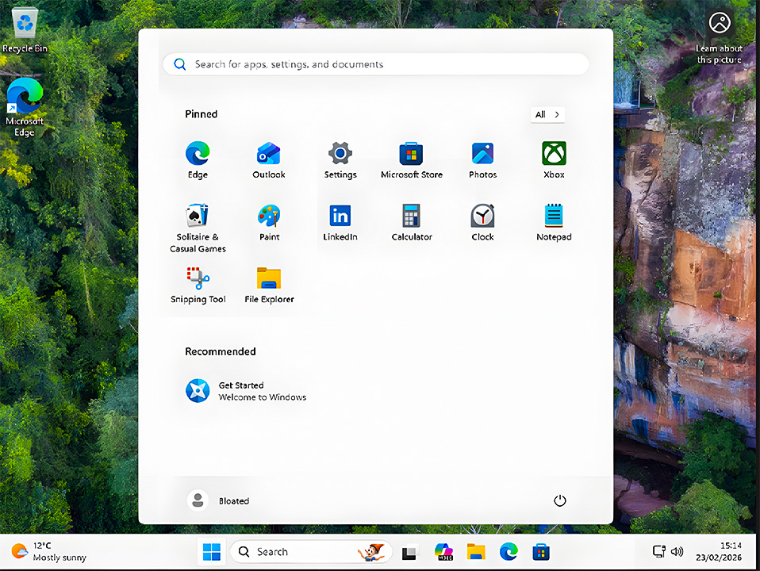
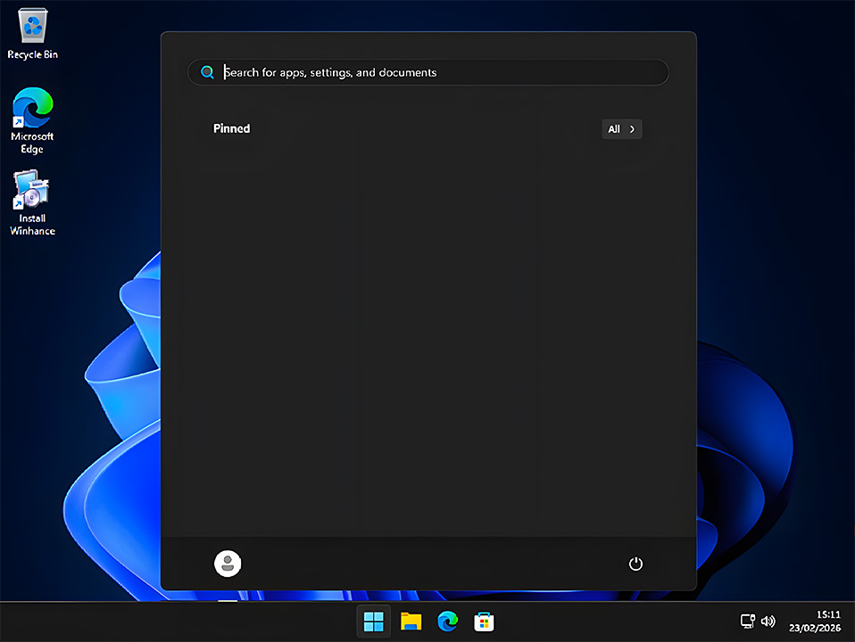

  

# WinCore 11

## Download

## 🖼️ Before / After

| Stock Windows 11 | WinCore 11 Edition |
|------------------|-------------------|
|  |  |

WinCore 11 leverages Microsoft's [Answer Files](https://learn.microsoft.com/en-us/windows-hardware/manufacture/desktop/update-windows-settings-and-scripts-create-your-own-answer-file-sxs?view=windows-11) to automate and fine-tune Windows 11 installations. It strips bloatware, applies system-level optimizations, and preserves the features that actually matter for daily use all without touching unofficial ISOs.

 

> [!NOTE]
> WinCore 11 is engineered with a specific philosophy: **maximum performance without sacrificing usability.** Xbox/Minecraft compatibility, touchscreen support, Microsoft Store, and biometric login are deliberately preserved. This is not a "nuke everything" script.

## What Does WinCore 11 Do?

### Core Optimizations

- **Bypasses Windows 11 system requirements** — TPM, Secure Boot, CPU and RAM checks.
- **Skips Microsoft account creation** during setup. Local account only.
- **Privacy & Security** — All telemetry, tracking, and advertising fully disabled.
- **Power Settings** — Winhance Power Plan applied for peak performance.
- **Bloatware Removal** — Copilot, OneDrive, sponsored apps, and junk services removed.
- **Windows Updates** — Auto-updates disabled; notifies only when updates are available.
- **Dark Mode** — Enabled on first login. All unwanted Start Menu pins removed.
- **Clean Explorer** — Classic right-click menu, file extensions visible, nav pane decluttered.

### WinCore 11 Exclusive Changes

| # | Change | Detail |
|---|--------|--------|
| 1 | **Edge Retained** | EdgeRemoval script omitted entirely |
| 2 | **Xbox & Minecraft Compatible** | GamingApp, XboxApp, TCUI and related packages kept |
| 3 | **SystemResponsiveness Fixed** | Corrected to `4294967295` (Windows default) |
| 4 | **Network Throttling Off** | `NetworkThrottlingIndex` set to `4294967295` |
| 5 | **Smart Power Throttling** | Skipped on laptops, applied on desktops via WMI battery check |
| 6 | **Faster Shutdown** | Page file no longer cleared at shutdown |
| 7 | **UAC Sequencing Fixed** | LUA re-enabled at end of setup to prevent drag-and-drop breakage |
| 8 | **TcpAckFrequency** | Set to `1` — Nagle's algorithm disabled for lower latency |
| 9 | **TCPNoDelay** | Enabled for faster TCP communication |
| 10 | **TcpDelAckTicks** | Set to `0` — delayed ACK timer disabled |
| 11 | **File Explorer Default** | Opens to "This PC" for all users via DefaultUser hive |
| 12 | **Start Menu Centered** | `TaskbarAl = 1` — Windows 11 default center alignment |
| 13 | **Microsoft Store Kept** | Store preserved for app access and updates |
| 14 | **Windows Photos Kept** | Modern Photos app retained; legacy viewer hacks removed |
| 15 | **Sleep & Lock Kept** | Start Menu sleep/lock options and Win+L shortcut preserved |
| 16 | **Background Apps Active** | UWP apps (WhatsApp, Mail, Spotify) notify normally |
| 17 | **System Tray Overflow Kept** | Background icons hidden in tray, not cluttering the taskbar |
| 18 | **Taskbar Icon Size Default** | `TaskbarSmallIcons` removed — causes graphical bugs on Win11 |
| 19 | **Touch & Biometrics Active** | WbioSrvc and TabletInputService left enabled for all devices |
| 20 | **Smooth UI Animations** | Balanced `UserPreferencesMask` — transitions feel premium, not broken |
| 21 | **Essential Apps Kept** | Mail & Calendar, Alarms & Clock, Camera retained out of the box |

## Usage

> [!IMPORTANT]
> The file **must** be named exactly `autounattend.xml`. Any other name will be ignored by the Windows installer.

1. Download `autounattend.xml` using the button above.
2. Place it at the **root** of your bootable Windows 10 or Windows 11 USB drive.
3. Boot from the USB and install Windows normally. Setup will handle the rest automatically.

## Acknowledgements

Built on top of the outstanding work by **[memstechtips](https://github.com/memstechtips)** and the **[UnattendedWinstall](https://github.com/memstechtips/UnattendedWinstall)** project. WinCore 11 extends that foundation with compatibility fixes, network tuning, and a usability-first philosophy.